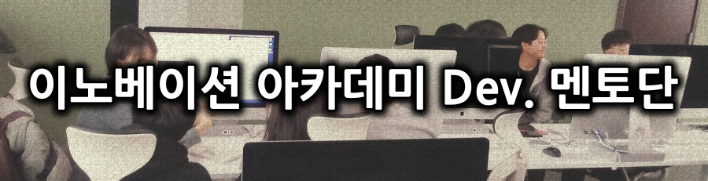

# 이노베이션 아카데미 Dev. 멘토단
</img>
  
이노베이션 아카데미를 안팎에서 도와주시는 "현업 개발자 멘토단"입니다.  
코드레벨의 코치부터 기업협력 프로젝트까지 다양한 개발자육성 프로그램에 참여해 주십니다.  
궁금하고 어려운 것이 있다면, 각 멘토분들을 찾아주세요. (자세한 내용은 별도 정리중) 
참고로 멘토이름은 "가나다" 순입니다.

멘토단은 현업 개발자분들께 언제나 열려 있습니다. 
자세한 내용은 재단 홈페이지의 채용공고를 참고해주세요.

- [전문멘토 지원서 작성](https://innovationacademy.kr/notice?board=4&post=45)
- [현업멘토단 지원서 작성](https://innovationacademy.kr/notice/4?board=4&label=5&post=64)

# 전문멘토 (재단 내 근무)
재단에 상주하며 학생들의 학습과정을 모니터링하고 도와주는 멘토들입니다. 
학습과정에 직접 관여하지는 않으나, 소프트웨어 개발자로서 다양한 고민을 함께 해주는 선배들입니다. 
새롬관 3층, "멘토라운지"로 오시면 항상 만나실 수 있습니다.  

## 김수보

자기소개
- 친절한 개발자 아저씨. 돈 안받으니까 궁금하면 언제든지 오세요.
- SNS서비스를 만들고 싶다면 자세히 말씀드릴께요.
- 적정기술론자, 실용주의개발 지지자
- 페이스북 : https://www.facebook.com/kimsubo

주요분야
 - 서버개발자, Java Spring
 - Open API, SNS 서비스
 - 대량트래픽 분산처리 (일 5억건 이상)

대외활동
 - http://okky.kr
 - 목각코, 아재개발단
 - beSUCCESS, 모비인사이드 컴럼기고

직장경력 : 1996년 ~ (24년차)
 - kth 개발팀 : 지도플랫폼, 글로벌 SNS 서비스
 - 지어소프트 : 이동통신 인프라, 인증, OpenAPI
 - 삼성 SDS

## 이호준

자기소개
- 페이스북 : https://www.facebook.com/hojun.lee.3511  

주요분야
- 게임 플랫폼 아키텍트
- 인터넷방송 플랫폼

대외활동
- 코딩클럽
- 엄마아빠가 알려주는 코딩
- 아프리카TV BJ (코딩으로우주정복)

직장경력 : 2004년 ~ (16년차)
- 아프리카TV ( FreecN CTO , https://www.podty.me/ )
- 네오위즈게임즈 (피망 https://www.pmang.com/ )

# 현업멘토 (일반기업 근무)
다양한 산업도메인의 일반기업에 근무를 하면서 학생들을 도와주시는 현업멘토분들입니다. 
역시 학습과정에 직접 관여하지는 않지만, 학생들을 기업의 세계로 직접 이끌어주실 분들입니다. 
그 직장이 궁금하다면 직접 물어보세요. 

## 김동수
자기 소개
- 무엇이 있는지 몰라 헤매이는 시작하는 개발자에게 도움이 되는 선배가 되어 드립니다.
- 개발과 개발자로써의 고민상담도 할 수 있어요.
- github repo : https://github.com/gitlabhq/gitlabhq
- 페이스북 : https://www.facebook.com/ds5apn 

주요분야
 - DevOps 
 - 협업잘하는 방법
 - API 플랫폼 
 - AWS
 - 회사시기에 맞는 적절한 기술 적용하기 

대외활동
 - 서강대 캡스톤 멘토
 - 소프트웨어 중심대학 오픈핵 멘토 
 - 소프트웨어에 물들다 강사
 - 목각코, 아재개발단

직장경력 : 2001년 ~ (20년차)
 - 현재 엘핀 CTO
 - 오아시스마켓 개발리더
 - 마켓컬리 CTO 
 - 넥스트매치(아만다) CTO
 - 지니뮤직(kt뮤직) 개발팀장 (DevOps, 개발, 협업문화)
 - kth DevOps팀 팀장 (DevOps, DevOps 개발툴 개발, 개발인프라 개선) 

## 김영훈
자기소개
 - 임베디드 시스템 개발 및 OS기초에 대해서 궁금하시면 오세요
 - 자연언어처리쪽 개발에 대해서 궁금하시면 달려오세요
 - 페이스북 : https://www.facebook.com/profile.php?id=1471225769

주요분야
 - 임베디드
 - 자연언어처리(NLP)

대외활동
 - TTA PG415 표준화
 - 창업진흥원 기업 멘토
 -  SW마에스트로 멘토

직장경력 : 1997년 ~ (23년차)
 - LG전자 MC연구소 (사설교환기, 휴대폰개발)
 - LG U+ (통신사 서비스 개발)
 - 테크빌교육(인공지능 LMS, AR,VR)
 - 청강문화산업대학교
 - 연암공과대학교

## 강진범

자기소개
- 개발적인 부분이든, 데이터 분석이든, 인공지능 전반적인 부분이든 어떤것이든 물어보세요.
- 참여중인 github repo : 기업지원 때문에 다 private 이라... 딱 제 마음입니다.
- 정기적으로 기술교류를 하는 private 모임을 진행하는데, 친목도모겸 기술 트렌드 공유정도 하고 있어요.
- 페이스북 : https://www.facebook.com/jinbeom.kang

주요분야
 - 데이터분석, 머신러닝, 딥러닝, 심볼릭 추론
 - SW아키텍처, SW테스트 등 SW품질

대외활동
 - SW마에스트로 멘토
 - 여러 해커톤 멘토 (서울시 서울이동통합서비스(Mass) 해커톤, 중앙대 다빈치 소프트웨어 해커톤 등)
 - 디자인패턴, SW공학, 인공지능, 데이터분석 강의 (LG전자, 메타넷 등)

직장경력 : 2004년 ~ (16년차)
 - 컴퓨터 공학박사 (세부전공: 인공지능, 인공지능 기술 논문 및 특허)
 - LG전자 (Android Framework, GPU/Graphics, AI Adaptation, Six Sigma MBB)
 - 신한은행 AI Lab (챗봇 기술 도입 및 전략 수립)
 - 자이냅스 CTO (심볼릭 대화추론 챗봇, TTS, 화자인식 기술 개발, 사용화)

## 김환태

자기소개
- LinkedIn: https://www.linkedin.com/in/hwan-tae-kim-6651663a/
- Bespin Academy(제작 및 운영): https://www.bespinacademy.com/
- Cloud와 Data에 대한 내용은 저한테 물어보세요!
- 페이스북 : https://www.facebook.com/profile.php?id=100001453421346

주요분야
- Data Platform 전반 : Database, Big Data, AI/ML, Visulization, IoT
- Cloud Coumputing 전반 : Azure 및 GCP 공인 강사 자격 보유

대외활동
- DATA INSIGHT STUDY BLOG - http://distudy.azurewebsites.net/
- 주요 온오프라인행사 스피커 참여

직장경력 : 1998년 ~ (22년차)
- Cloud 및 Data&ML 전문가
- 한국 대표 유니콘 후보 클라우드 스타트업인 베스핀 글로벌의 Bespin Academy Team
- 내부 직원 및 고객 역량 강화 업무를 담당
- Microsoft Consulting Services에서 Data & AI Architect로 근무
- 다양한 국내외 Cloud 및 Data 관련 프로젝트에 참여한 경험을 가지고 있습니다.

## 박조은

자기소개
- 실패가 두렵거나 뭘 해도 잘 안 되는거 같고 힘들고 어려울 때 도움을 드리고 싶어요.
- 페이스북 : https://www.facebook.com/zzonee
- GitHub : https://github.com/corazzon
- YouTube : https://www.youtube.com/c/todaycode

주요분야
- 데이터분석, 머신러닝
- 서버개발, Python, Ruby

대외활동
- 오늘코드 유튜브 채널 운영
- 파이썬 한국 사용자모임
- 파이콘 한국 준비위원회 2019년 졸업
- 행정안전부 정부혁신 국민포럼 2기 디지털분과 운영위원

직장경력 : 2003년~
- 엔비티(캐시슬라이드, Adison 백엔드 개발)
- 네오위즈 게임즈(모바일 게임서버 개발)
- 엔플루토(게임 웹서버 개발)
- 윤디자인연구소(윤폰트 관련 개발)
- 인우기술 연구소(웹 개발)

## 박은종
자기소개
- 10여년 개발을 하고 10여년 강의를 하여 개발과 교육에 모두 경험이 있는 좋은 선생님입니다.
- 여러분이 공부하며 나아가는 길에 작은 돌맹이와 허들을 치워줄 수 있는 조력자가 되고 싶네요
- 페이스북 : https://www.facebook.com/eunjong.park.5
- 블로그 : https://blog.naver.com/bell01

주요분야
 - 프로그래밍 언어 : C, Java, C++, Python
 - 자료구조, 알고리즘
 - 객체 지향 설계, 디자인 패턴

대외활동
 - NAVER 소프트웨어야 놀자 교육
 - 소프트웨어에 물들다 참여
 - 패스트 캠퍼스, 인프런, 유튜브 동영상 강좌

직장경력 : 1996년 ~ (24년차)
- 현대 정보기술 인프라 시스템 개발
- 웹 플러스 그룹웨어 시스템 개발
- 스펙트라 고객 관리 시스템 개발
- 비트 컴퓨터, TAcademy 강사
- 국민대, 경희대 비전공자 대상 프로그래밍 강의  
- NHN NEXT 겸직교수

저서
- "Do it 자바 프로그래밍 입문" (이지스 퍼블리싱)

## 배권한 ( 다즐링 )

자기소개
- 미래의 동료들과 같이 성장하고 싶은 엔지니어입니다.
- 서로 존중하고 싶고 서로 성장하기를 바랍니다.
- 주로 파이썬을 사랑하지만 다른 분야도 필요하다면 공부합니다.
- 페이스북 : https://www.facebook.com/kwonhan.bae

주요분야 
- 서비스에 필요하다면 가리지 않음
- 서비스를 위한 처음부터 끝까지 가능하고 해봤음 ( 글로벌 유저 2억이상 )

대외활동
- 파이콘 한국을 시작함 
- 파이썬 사용자 모임 이사장

직장경력 : 1999년 ~
- 기타 여러가지경력으로 다양한 분야의 컨설팅을 함
- CDNetworks GSI 팀 (글로벌 서비스, 대용량 트래픽 운영)
- 그루폰 인프라 본부장 (서비스 총괄)
- 라인 플러스 서비스엔지니어링팀  (글로벌 서비스, 대용량 트래픽 담당)

## 송준호
자기소개 
- 커피와 수다
- 페이스북 : https://www.facebook.com/junho.jeremy.song 

경력 
- ZeroOne AI Inc. 창업자 
- 스위스 SIX그룹 F10 프로그램 2019년 Cohort 
- 캐나다 Next AI 2018년 Cohort 
- Y Combinator Startup School 2018년 Cohort
- 국방과학연구소(ADD) 인공지능 시스템 개발 : D-Net, D-Gen 
- AI Finance 오픈 커뮤니티 리더
- 서울대학교 융합과학기술대학원 PhD Candidate 

주요분야
- 인공지능 시스템 아키텍쳐 개발 
- 인공지능 모델 개발 (금융, 의료) 

대외활동
- AI COLLEGE 양재혁신센터 금융데이터 AI분석 멘토 

## 전미정

자기소개
- 안녕하세요, 미정입니다! 
- 재미있는 걸 공부하고 개발하면서 경험한 내용을 공유하는 걸 좋아합니다.
- 기술에 가치를 담아 세상과 연결하는 개발자가 될 수 있길 노력합니다.
- 어떻게 하면 즐겁게 일할 수 있는가에 대해 많이 고민하고있습니다.
- 만나서 반갑습니다.
- 페이스북 : https://www.facebook.com/Ninevincent
- GitHub : https://github.com/MijeongJeon

주요 분야
- iOS 모바일 애플리케이션
- AI, 머신러닝, 케라스

대외활동
- 케라스 코리아
- 오픈소스 컨트리뷰톤
- 마이크로소프트 AI MVP
- 친절한 AI 유투브 운영

## 조현종

추천사 (김수보)
- 우리나라 오픈소스계를 개척하는 만랩 개발자 아저씨
- 대표인데 아직도 직접 개발을 하심. 아주 친절함.
- 오픈소스를 통해 성장하고 싶은 학생에게 완전 강추

자기소개
- 페이스북 : https://www.facebook.com/hangum

직장경력 :  
- 테드폴허브 (테드폴디비허브 개발) : https://www.tadpolehub.com/
- KTInnotz (PaaS 개발팀에서 개발도구 개발)
- 맨텍(HA 소프트웨어 개발팀에서 서버 UI개발)

## 야곰
자기소개
- 프로그래밍 입문자가 프로그래밍을 조금 더 재미있고 올바르게 학습하는 것,
- 프로그래머들이 조금 더 올바르고 탄탄하게 프로그래밍 할 수 있는 데에 관심이 많습니다.
- 지름길보다는 정도를 좋아합니다.
- 자세한 소개 : https://blog.yagom.net/about-yagom/
- 페이스북 : https://www.facebook.com/yagomsoft

주요분야
- iOS 모바일 애플리케이션 개발

대외활동
- let us: Go! [iOS 앱 개발자 컨퍼런스 운영]
- yagom.net - 야곰닷넷 [iOS 앱 개발자 커뮤니티 운영]
- 팟캐스트 [아궁이 : IT가 궁금한 이들의 이야기] 진행
- 유투브 [야곰의 프로그래밍 채널] 운영

주요경력 : 2010~ (11년차)

## 오종인
자기소개
 - 까칠하지만 착하게 살고 싶은 개발자 출신 관리자 
 - 페이스북 : https://www.facebook.com/ohjongin

주요분야
 - Android 앱 개발
 - node.js
 - AWS

직장경력: 1998년 ~ (22년차)
 - LG전자/모토로라/SK텔레텍/팬택 핸드폰 S/W 개발
 - kth 개발팀 (Android, 글로벌 모바일 서비스 개발)
 - 포인트웰 (다이소 멤버십 서비스 개발)

## 이건재

자기소개
  - 10년전부터 멘토링을 통해서 저는 멘티들의 열정을 받아 고무되고 그들은 제 개발, 프로젝트 경험을 토대로 함께 프로젝트를 진행했습니다.
  - 멘토링이 내가 가지고 있는 것을 단순히 전달만하는것이 아닌 그 과정에서 저 또한 성장할 수 있음을 알았을때 
  - 그때부터 이런 멘토링 과정은 제가 하나의 큰 성장의 발판이 되며 SW를 업으로 살고 있는 제게 큰 보람을 줄 수 있는 영역이 되었습니다.
  - 함께 큰 성장을 이룰 수 있도록 했으면 합니다."

주요분야
  - 블록체인, DID, hyperledger
  - 스마트미디어, SW아키텍쳐, Linux

대외활동
  - 한이음 멘토, SW마에스트로 멘토, SW고성장 200 멘토
  - Hyperledger korea meetup

직장경력 : 1999~(21년차)
  - LG CNS(임베디드 SW, 스마트미디어개발, 블록체인 개발)
  - KTH(스마트미디어, 모바일 개발)
  - 중소기업진흥공단(개발팀)

## 이인제 (소플)
자기소개
- 개발을 사랑하는 Software Engineer
- 분야 가리지 않고 필요하다고 생각되는건 모두 공부하면서 개발해왔습니다.
- 제가 머리가 별로 좋지 않아서 어렵게 가르치는걸 좋아하지 않습니다.
- 어렵게 느껴지는 개발을 쉽고 재미있게 배울 수 있도록 도와드리겠습니다.
- 페이스북 : https://www.facebook.com/soaple
- 블로그 (http://blog.soaple.io/)
- YouTube 채널 (http://www.youtube.com/channel/UC8YIgyBkvoyYfbCO4rkaTxw)

주요분야
- Node.js
- AWS
- React
- ReactNative
- Dashboard

대외활동
- [공개SW 프로젝트 "Stickyboard" 오너](https://github.com/soaple/stickyboard)
- [구름 에듀 무료 강의 운영](https://edu.goorm.io/lecture/12976/%EC%B2%98%EC%9D%8C-%EB%A7%8C%EB%82%9C-react-%EB%A6%AC%EC%95%A1%ED%8A%B8)
- 연세대, 비트교육센터 등 출강

개발경력: 2012년 ~ (9년차)
- KTNET 사원 (Wi-Fi 기반 실내 측위 시스템, Android 실내 측위 앱 개발)
- NemusTech 선임연구원 (Wi-Fi 및 블루투스 기반 실내 측위 시스템 개발)
- Lingofly CTO (WebRTC 기반 화상대화 시스템 개발)
- KAIST ISILAB 연구원 (iOS 실내 측위 앱 개발, 측위 데이터 분석 대시보드 개발)
- 디드래곤게임즈 매니저 (DB설계, 게임 데이터 분석 대시보드 개발)
- 소플 소프트웨어 엔지니어 (Android, React, ReactNative 프리랜서 개발)

## 이태영
자기소개
- 서로 소통하며 지내요.
- 페이스북 : http://www.facebook.com/tylee8033

주요분야
- 딥러닝 (VISION, 챗봇)
- 머신러닝
- 데이터 분석

대외활동
- AI ROBOTICS KOREA 운영진
- KERAS KOREA 운영진

직장경력 : 2005~ (15년차)
- 신한은행 Chief Research Engineer 
  (쏠 메이트 챗봇, 쏠 리치, 오픈뱅킹 목돈마련, OCR VISION PLATFORM)
- POSCO ICT - Chief Architect  
   딥러닝 프레임워크 제작 (TensorMSA), 포스코 사람찾기 챗봇, 포스코 108개 해외법인 그룹웨어 구축 
   모바일 프레임워크 구축, Smart Work Place 포스코 전사 시스템 구축 
- 삼성전자,LG전자 안드로이드 폰 개발
- 국민은행 KB STAR BANK ANDROID APP제작